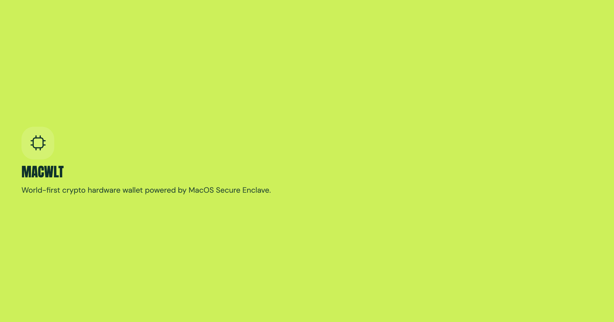

<!--
 Copyright (c) 2026 macwlt contributors.
 SPDX-License-Identifier: Apache-2.0
-->

<div>
    
</div>

# macwlt

Self-custodial wallet infrastructure for macOS, backed by Secure Enclave signing.

macwlt keeps private-key operations local and exposes a native core, an XPC signing service, and a TypeScript CLI for wallet creation, key/address export, and transaction signing.

> **Alpha.** macwlt is under active development. Interfaces may change and signing behaviour has not been fully audited.

## Install

```shell
npm -g i @macwlt/cli
```

## Agent Skills

The `mac-wallet` plugin provides guarded agent workflows. Its first skill resolves requests such as "Send 10 USDC on Base to `0x...`", verifies balances, asks for confirmation, and submits via the CLI.

Install the skill for the detected agent:

```shell
./install-skill.sh
```

See [`plugins/mac-wallet/README.md`](plugins/mac-wallet/README.md) for direct plugin installation and testing.

## License

Apache-2.0. See [LICENSE](LICENSE) and [NOTICE](NOTICE).