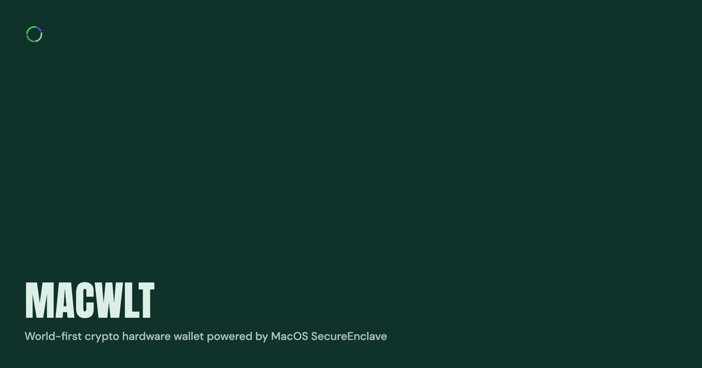

<!--
 Copyright (c) 2026 macwlt contributors.
 SPDX-License-Identifier: Apache-2.0
-->

<div>
    
</div>

# macwlt

Self-custodial wallet infrastructure for macOS, backed by Secure Enclave signing.

macwlt keeps private-key operations on the local Mac and exposes a small native core,
an XPC signing service, and a TypeScript CLI for wallet creation, public-key/address
export, and transaction signing.

## Development

Install Node.js 20 or newer, pnpm 10 or newer, and Bun 1.2 or newer. Then install
the macOS native build dependencies:

```shell
brew bundle
```

Fetch vendored dependencies, install workspace dependencies, and build everything:

```shell
make submodules
pnpm install
pnpm build
```

Run the native XCTest and CLI unit suites:

```shell
pnpm test
```

Package-scoped commands use pnpm filters:

```shell
pnpm --filter @macwlt/core build
pnpm --filter @macwlt/cli typecheck
pnpm --filter @macwlt/cli test
```

## Agent Skills

The `mac-wallet` plugin contains guarded workflows for using macwlt through an
agent. Its first skill resolves requests such as "Send 10 USDC on Base to
`0x...`", verifies balances, asks for final confirmation, and submits the
transfer through the CLI.

Install the standalone skill for the detected agent:

```shell
./install-skill.sh
```

See [`plugins/mac-wallet/README.md`](plugins/mac-wallet/README.md) for direct
plugin installation and testing.

## License

Apache-2.0. See [LICENSE](LICENSE) and [NOTICE](NOTICE).
